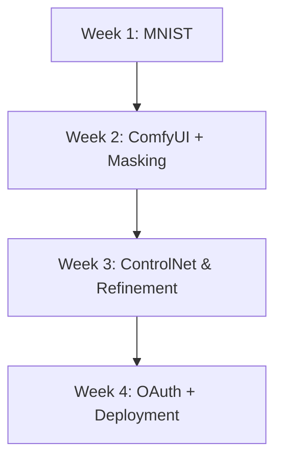

# Welcome to My Internship Log

> **Internship Role**: AI/ML Intern  
> **Company**: SynerSense Pvt. Ltd.  
> **Mentor**: Praveen Kulkarni Sir  
> **Duration**: May – July 2025  

---

{: .callout-info }
### 🔍 What You’ll Find Here
This space documents my journey as an intern, filled with weekly logs, hands-on experiments, key learnings, and all the technical depth I’ve explored so far.

---

## What This Site Contains

This space is a weekly journal of everything I'm working on during my AI/ML internship. It includes:

- Weekly goals
- Completed tasks
- Technical learnings
- Experiments & findings
- Tools explored (e.g., ComfyUI, Hugging Face, Label Studio)
- Links to relevant demos & repositories

Whether you're a fellow intern, mentor, or someone curious about the process — you're welcome here!

---

## Weekly Progress Logs

| Week | Dates               | Highlights                                      |
|------|---------------------|--------------------------------------------------|
| [Week 01](logs/week-01.md) | May 25 – June 1   | MNIST unsupervised pretraining & binary classifier |
| [Week 02](logs/week-02.md) | June 2 – June 8   | ComfyUI, face masking, scar inpainting             |
| [Week 03](logs/week-03.md) | June 15 – June 22 | ControlNet, scar replacement, facial refinement    |
| [Week 04](logs/week-04.md) | June 23 – June 30 | OAuth login in HF Spaces, Docker fixes             |

> Updated every week with new logs and insights.

---

## Tools & Topics Explored

- **AI/ML**: PyTorch, classification, autoencoders, inpainting
- **Frameworks**: Hugging Face Spaces, Gradio, Label Studio
- **Visual Tools**: ComfyUI, ControlNet, Stable Diffusion
- **Infra & Debugging**: Docker, Python envs, permission handling

---

## 💡 Sample Workflow Diagram

## Let’s Connect

Feel free to reach out or check my other work:

- 🔗 [GitHub Profile](https://github.com/sanjanb)
- 📨 [Email](mailto:sanjanacharaya1234@gmail.com)

---

> _“Learning by building, failing, debugging, and documenting — that’s the real internship experience.”_

